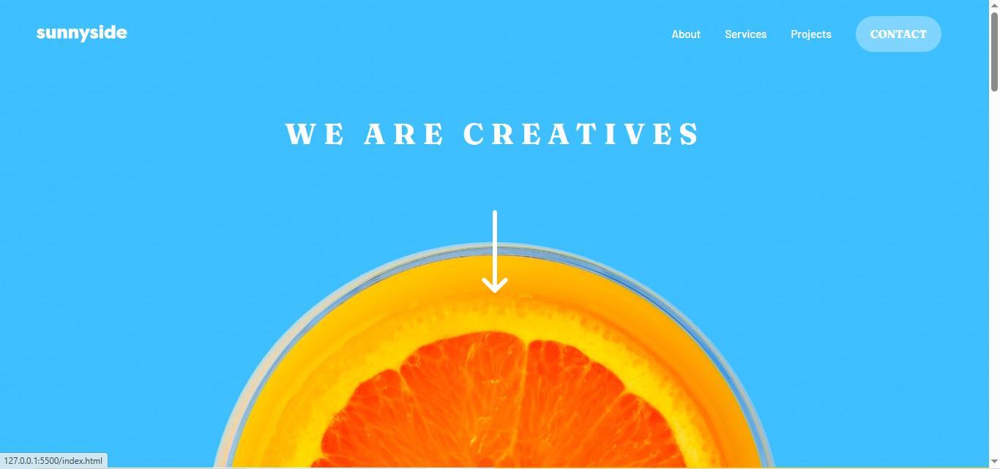
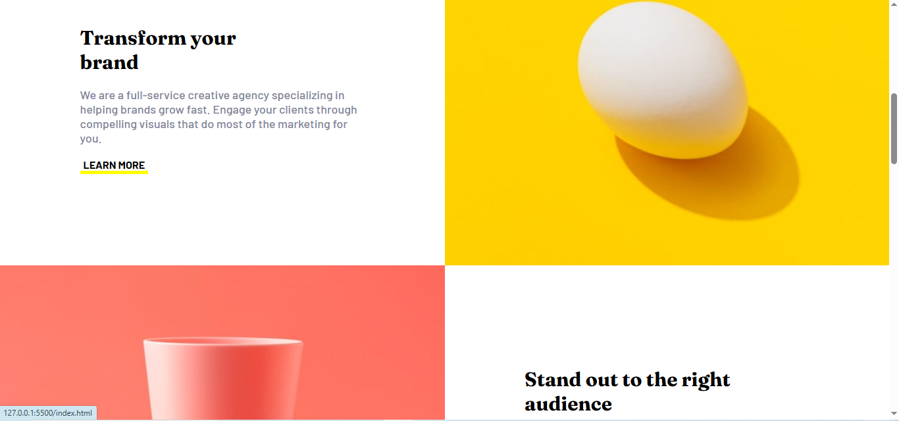
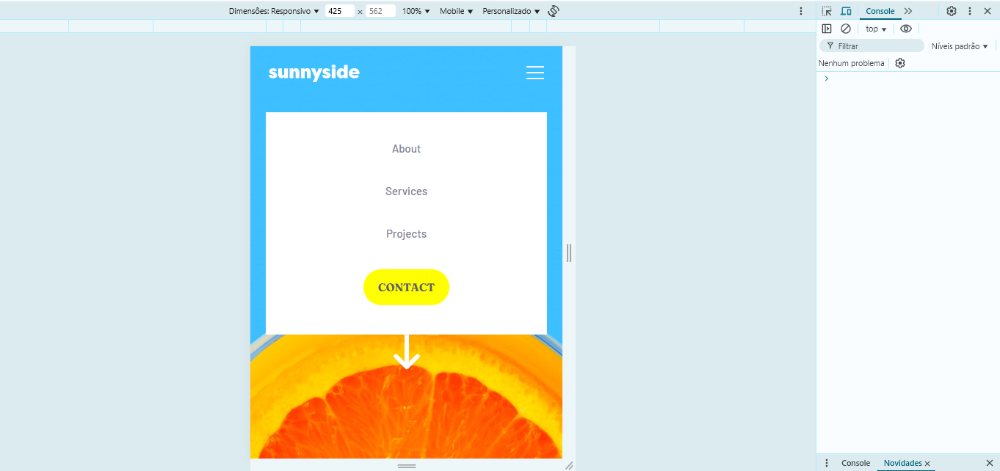
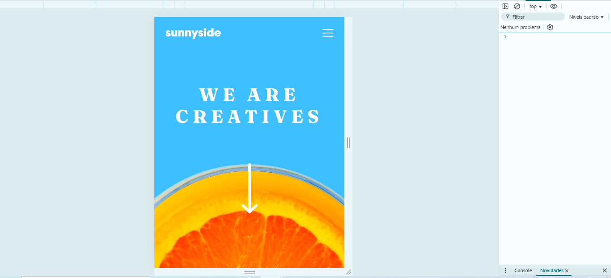

# Frontend Mentor - Solução para a Landing Page da Sunnyside Agency

Esta é uma solução para o [desafio da landing page da Sunnyside Agency no Frontend Mentor](https://www.frontendmentor.io/challenges/sunnyside-agency-landing-page-7yVs3B6ef). 

## Índice

- [Visão Geral](#visão-geral)
  - [O desafio](#o-desafio)
  - [Captura de tela](#captura-de-tela)
  - [Links](#links)
- [Meu processo](#meu-processo)
  - [Tecnologias utilizadas](#tecnologias-utilizadas)
  - [Desenvolvimento contínuo](#desenvolvimento-contínuo)
- [Autor](#autor)

## Visão Geral

### O desafio

Os usuários devem ser capazes de:

- Ver o layout ideal para o site dependendo do tamanho da tela de seu dispositivo
- Ver os estados de hover para todos os elementos interativos na página

### Captura de tela

### Links

- Solução no GitHub: [(https://github.com/frontend-mentor-projects-dhBarankievicz/Product-preview-card-component.git)]

## Meu processo

### Tecnologias utilizadas

- Marcações semânticas com HTML5
- Propriedades customizadas do CSS
- Flexbox
- Javascript

### Desenvolvimento contínuo

Durante este projeto, percebi que ainda tenho espaço para evoluir em algumas áreas importantes do desenvolvimento front-end:

- **Acessibilidade (a11y):** Quero me aprofundar nas melhores práticas para tornar meus sites mais acessíveis a todos os usuários, especialmente no uso de ARIA labels, contraste de cores e navegação por teclado.
- **Animações CSS e transições suaves:** Usei algumas transições simples no projeto, mas quero explorar animações mais avançadas que melhorem a experiência do usuário sem comprometer a performance.
- **Performance e otimização de imagens:** Pretendo estudar mais sobre lazy loading, compressão de imagens e uso eficiente de formatos como WebP para tornar minhas páginas mais leves e rápidas.
- **Componentização com Styled Components:** Embora já tenha usado Styled Components, ainda estou entendendo como estruturar melhor os estilos por componente e reaproveitá-los entre páginas de forma eficiente.

